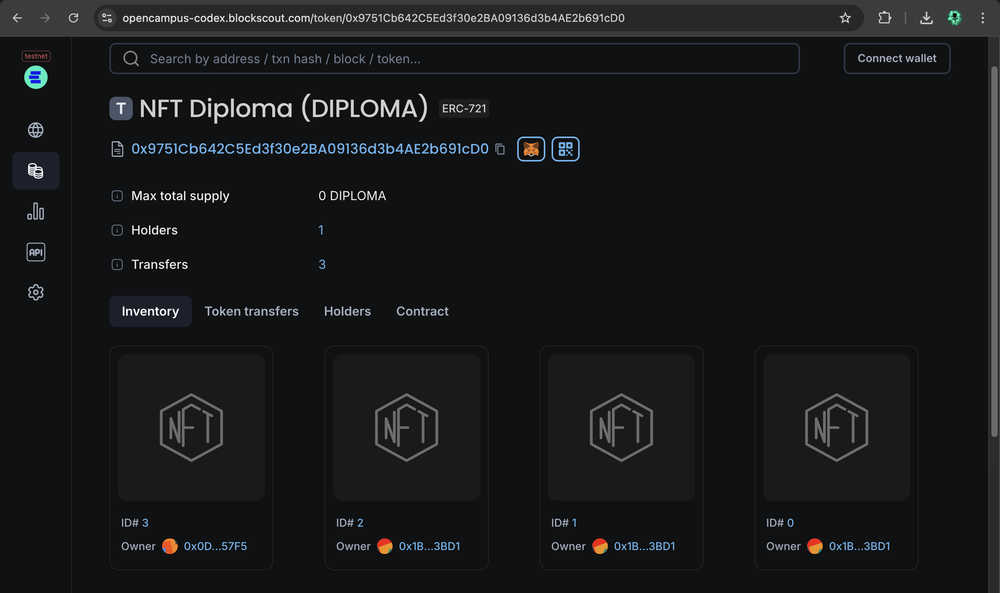

# NFT Diplomas

## Vision

NFT Diplomas aims to revolutionize the way academic achievements are recognized and verified by issuing Non-Fungible Tokens (NFTs) as verifiable diplomas on the blockchain. Built on Educhain and utilizing Arbitrum Orbit, our platform ensures that diplomas are secure, tamper-proof, and easily accessible, providing a modern and efficient solution for graduates and educational institutions.

## Project Features

- **Minting Diplomas**: Securely issue NFTs representing diplomas to graduates with detailed metadata, including the recipient's name and the details of the diploma.
- **Verifiable Records**: Each diploma NFT is a unique and immutable record on the blockchain, making it easy to verify authenticity and prevent fraud.
- **Ownership Tracking**: Track and manage diploma ownership with precise on-chain records, ensuring transparency and accountability.
- **Customizable Metadata**: Attach detailed information to each diploma NFT, providing rich context and proof of academic achievements.

## Future Scope

- **Integration with Educational Institutions**: Partner with universities and colleges to streamline the diploma issuance process and integrate with existing student management systems.
- **Enhanced Metadata**: Expand metadata capabilities to include additional information such as course details, grades, and certifications.
- **User Interface**: Develop a user-friendly web and mobile application for graduates and institutions to interact with the NFT Diplomas platform.
- **Interoperability**: Explore opportunities to integrate with other blockchain platforms and NFT standards to broaden the scope and usability of diploma NFTs.

## Project Structure

- **`contracts/`**: Contains the Solidity smart contract code for issuing and managing diploma NFTs.
  - `BasicERC721.sol`: Implements the core functionality for minting, transferring, and querying diploma NFTs.
- **`scripts/`**: Includes deployment and testing scripts for interacting with the smart contract.
- **`test/`**: Contains test cases to ensure the reliability and correctness of the smart contract.
- **`README.md`**: This file, providing an overview of the project.

## Developer Details

- **Project Lead**: [Your Name](mailto:your.email@example.com)
- **Contact**: [Your Email](mailto:your.email@example.com)
- **GitHub**: [Your GitHub Profile](https://github.com/yourusername)
- **LinkedIn**: [Your LinkedIn Profile](https://www.linkedin.com/in/yourprofile)

---

Thank you for checking out NFT Diplomas! We are excited to bring innovation to diploma issuance and look forward to contributing to the future of education technology.

Vision:

contract address: 0x3cc6ab0bba15c18d2871ffe495f02c7f0fcd2590

